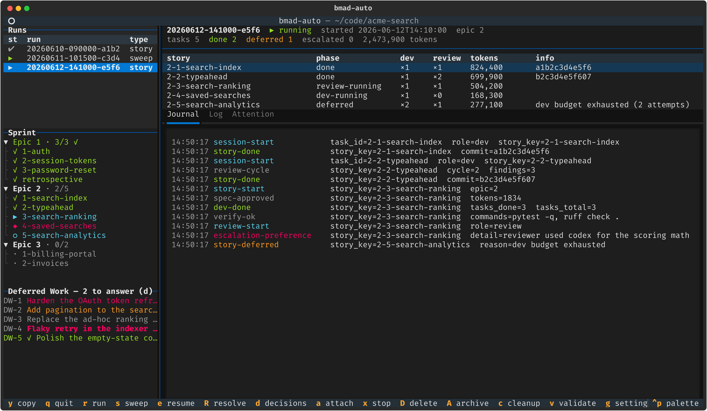
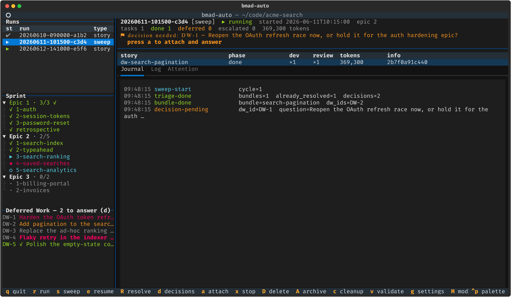
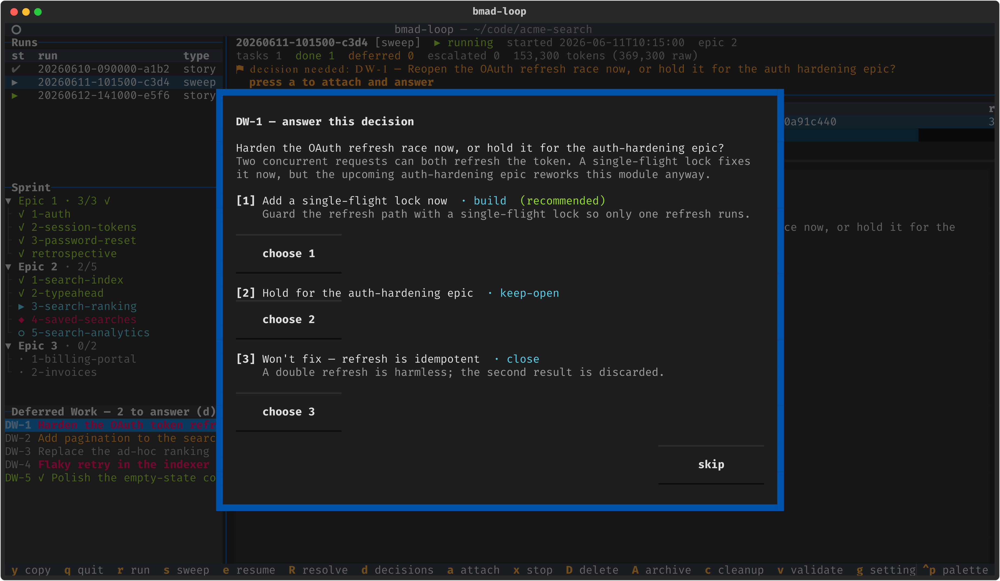
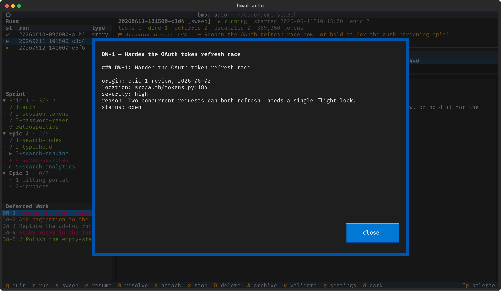
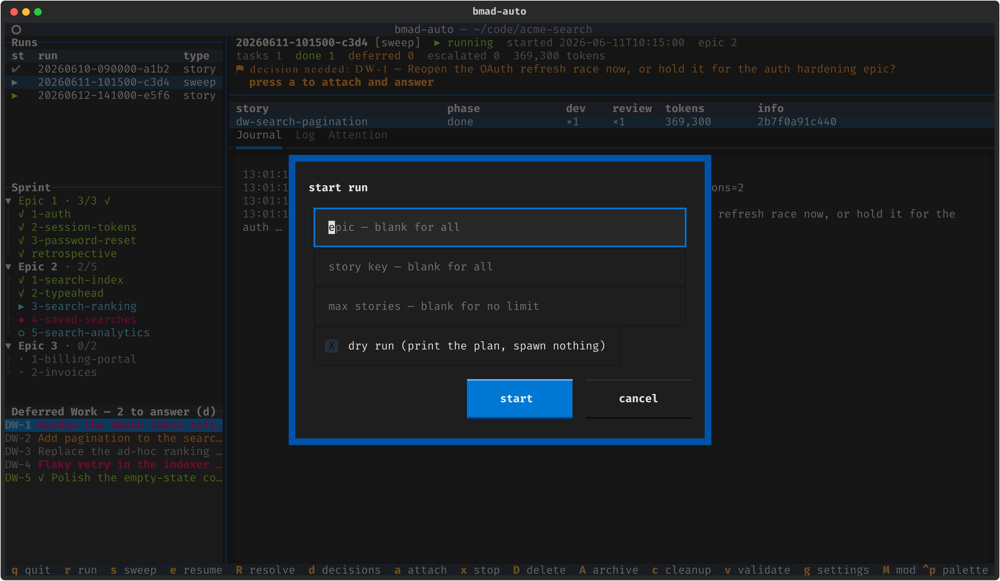
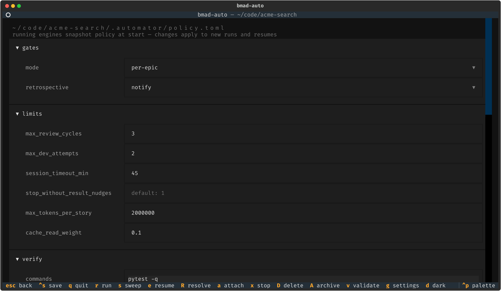
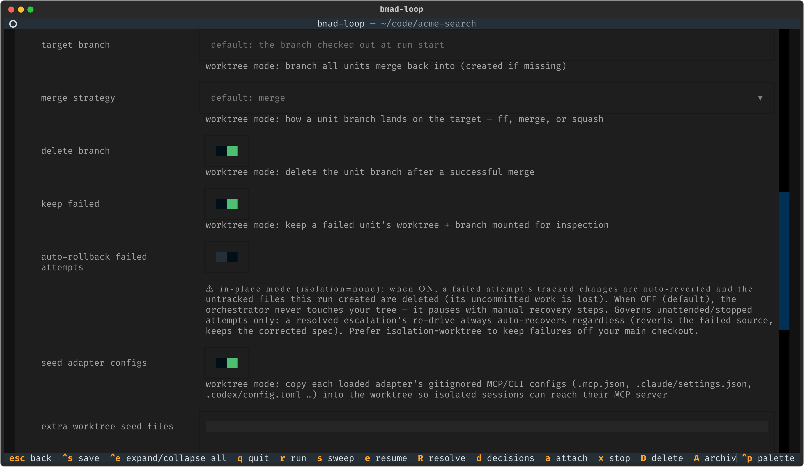

# bmad-loop

<div align="center">

**A deterministic ralph-loop orchestrator for the [BMAD-METHOD](https://github.com/bmad-code-org/BMAD-METHOD) implementation phase**

Plain Python drives the loop — **pick story → implement → adversarially review → verify → commit** — while LLMs do only the creative work, inside disposable, fresh-context coding-agent sessions you can attach to and watch.

[](https://github.com/bmad-code-org/bmad-loop/actions/workflows/ci.yml)




<sub>The live TUI dashboard — run picker, sprint tree, deferred-work ledger, per-story task table, and a tailing journal. <a href="#the-tui">Jump to the TUI tour ↓</a></sub>


<sub>A tour of the dashboard — walking the runs table, unfolding the sprint tree, opening a deferred-work entry, answering a decision a past sweep left unanswered, typing a story into the start-run modal, a sweep blocked on a decision, and scrolling the policy editor out to its worktree-isolation + config-seeding knobs. <a href="#the-tui">More on the TUI ↓</a></sub>

</div>

---

## Why bmad-loop

Inspired by the original [bmad-automator](https://github.com/bmad-code-org/bmad-automator) (a separate, legacy project), it takes a token-optimized approach in which the orchestrator is ordinary code rather than an LLM session in the control loop:

- 🧠 **No LLM in the control loop.** Story selection, retry budgets, gates, and completion checks are code, not prompts — so they're deterministic, debuggable, and free.
- 📡 **No pane-scraping.** Coding-agent hooks (`Stop` / `SessionStart` / `SessionEnd` / `PreCompact`) write structured event files the orchestrator watches; skills in automation mode write a machine-readable `result.json` at the end of each workflow.
- 🔍 **Trust nothing, verify everything.** After each session the orchestrator checks artifacts on disk: spec frontmatter status, baseline-commit match (recorded independently — a cheap LLM-lie detector), non-empty diff, sprint-status sync, and _your_ test/lint commands before any commit.
- 📒 **One source of truth.** `sprint-status.yaml` is owned by the BMAD skills; the orchestrator only ever reads it.
- 🪟 **Fresh context per step.** Dev and review are separate sessions — review never inherits the implementer's context, so there's no anchoring bias.
- ♻️ **Resumable & multi-agent.** Every run is a resumable state machine on disk, and a generic tmux adapter drives `claude`, `codex`, `gemini`, `copilot`, or `antigravity` (mix per stage).
- 🌿 **Optional worktree isolation.** Opt in (`[scm] isolation = "worktree"`) and each story runs in its own git worktree/branch and merges back locally — your main checkout stays free while a run is in flight.

## Requirements

- **Python 3.11+**, a **terminal multiplexer** (tmux is the bundled default), and a supported coding CLI — `claude` by default; `codex`, `gemini`, `copilot`, and `antigravity` (`agy`) via [profiles](#other-coding-clis).
- **Linux or macOS** (or **Windows via WSL**, which _is_ Linux — it runs as-is). tmux is the bundled terminal-multiplexer backend (externals like the [herdr adapter](https://github.com/pbean/bmad-loop-adapter-herdr) co-install as packages and self-register — see [Terminal multiplexer backends](docs/multiplexer-backends.md)), and all of it sits behind a pluggable **registry** of OS seams (transport, process lifecycle, hook interpreter) with availability-aware selection — env var → persisted `[mux] backend` choice (`bmad-loop mux set <name>`) → platform default (`psmux` on Windows, `tmux` elsewhere) → first available platform match — so a native-Windows backend slots in as new files + a registration line each, with no engine edits — see [Porting bmad-loop to a new OS](docs/porting-to-a-new-os.md). Native Windows is not yet shipped.
- A **BMAD v6 project** (`_bmad/bmm/config.yaml`, a `sprint-status.yaml` from `bmad-sprint-planning`) with the upstream `bmad-dev-auto` skill (and the three review-hunter skills its step-04 invokes inline: `bmad-review-adversarial-general`, `bmad-review-edge-case-hunter`, `bmad-review-verification-gap`) and the bmad-loop skill module from this repo installed (`bmad-loop-resolve`, `bmad-loop-sweep` — see [Installing the skill module](#installing-the-skill-module)). Standard BMAD skills stay untouched.

## Quick start

```bash
uv sync --extra tui              # core is pyyaml-only; [tui] adds the dashboard

cd /path/to/your/bmad/project
bmad-loop init                   # installs bmad-loop-* skills + hooks + .bmad-loop/policy.toml + gitignore
bmad-loop validate               # preflight: config, sprint-status, git, tmux, CLI, hooks
bmad-loop run --dry-run          # print the plan without spawning anything
bmad-loop run                    # go
bmad-loop tui                    # …or drive everything from the dashboard
```

> **One-time setup:** if the coding CLI has never run in the target project, start it once (`claude`) and accept the workspace-trust dialog (and any hooks-approval prompt) before `bmad-loop run`. Spawned sessions can't answer first-run dialogs, and a pending dialog reads as a session timeout to the orchestrator.

## Command reference

| Command                                                  | What it does                                                                                                                                                                                                                                                                                                                                                                                                                                                                                                                                                                                                                                                                                                                             |
| -------------------------------------------------------- | ---------------------------------------------------------------------------------------------------------------------------------------------------------------------------------------------------------------------------------------------------------------------------------------------------------------------------------------------------------------------------------------------------------------------------------------------------------------------------------------------------------------------------------------------------------------------------------------------------------------------------------------------------------------------------------------------------------------------------------------- |
| `bmad-loop init`                                         | Install the bundled `bmad-loop-*` skills, the hook relay, `.bmad-loop/policy.toml`, and a gitignore for the runs dir, plugin caches, and policy.toml itself (policy is per-machine — see the CHANGELOG migration note for repos initialized before this). `--cli <profile>` (repeatable) targets specific agents; `--no-skills` / `--force-skills` control skill copying.                                                                                                                                                                                                                                                                                                                                                                |
| `bmad-loop validate`                                     | Preflight every prerequisite: BMAD config, sprint-status, git, CLI binary, hook registration, and a platform check that reports the selected multiplexer's readiness and process host (listing every registered backend when more than one is detected).                                                                                                                                                                                                                                                                                                                                                                                                                                                                                 |
| `bmad-loop mux`                                          | List registered terminal-multiplexer backends — platform match, availability, version, and which one is selected (and why). `mux set <name>` persists a machine-scoped choice into `.bmad-loop/policy.toml` (`--clear` reverts to auto-select, `--force` allows a name that only registers on the target machine); the `BMAD_LOOP_MUX_BACKEND` env var outranks it.                                                                                                                                                                                                                                                                                                                                                                      |
| `bmad-loop run`                                          | Drive the dev → review → verify → commit loop. `--epic N`, `--story KEY`, `--max-stories N`, `--dry-run`. `--spec <folder>` forces **stories mode** (folder+id dispatch off `<folder>/stories.yaml`), overriding `[stories].source`; `--story` then filters by story id.                                                                                                                                                                                                                                                                                                                                                                                                                                                                 |
| `bmad-loop sweep`                                        | Triage + execute open `deferred-work.md` entries. `--no-prompt`, `--decisions-only`, `--max-bundles N`, `--repeat`, `--max-cycles N`, `--dry-run`.                                                                                                                                                                                                                                                                                                                                                                                                                                                                                                                                                                                       |
| `bmad-loop resume <run-id>`                              | Continue a run paused at a gate, escalation, or interruption.                                                                                                                                                                                                                                                                                                                                                                                                                                                                                                                                                                                                                                                                            |
| `bmad-loop resolve <run-id>`                             | Resolve a CRITICAL escalation: open an interactive resolve agent to fix the frozen spec, then re-arm the story and resume. On an _intent gap_ the re-drive can resume review on the attempted change instead of re-implementing it. `--story KEY`, `--no-interactive`, `--restore-patch <path>` (intent-gap patch-restore), `--resume` / `--no-resume`.                                                                                                                                                                                                                                                                                                                                                                                  |
| `bmad-loop decisions`                                    | Answer deferred-work decisions earlier sweeps left unanswered (skipped by `--no-prompt`, or an abandoned interactive sweep). Recorded so the next sweep acts on them without re-asking. `--list` shows them without answering; `--json` emits them as a stable machine-readable document — id, question, context, recommendation, and every option's key/label/effect/intent/resolution/bundle-name with a derived `recommended` flag. It implies the listing and never prompts, so a script can select an option by policy instead of scraping the text.                                                                                                                                                                                |
| `bmad-loop list` (`ls`)                                  | List every run/sweep with its short ref, type, and status — the handle you pass to the commands below.                                                                                                                                                                                                                                                                                                                                                                                                                                                                                                                                                                                                                                   |
| `bmad-loop status [<run-id>]`                            | Run + sprint summary with per-story token totals — cost-weighted, with the raw count alongside — plus a count of decisions awaiting an answer. A stories-mode run instead prints its stories board — id, live on-disk state, checkpoint markers, title. `--json` replaces all of that with a stable machine-readable document (see [Scripting `status`](#scripting-status)).                                                                                                                                                                                                                                                                                                                                                             |
| `bmad-loop diagnose [<run-id>]` (`diag`)                 | Emit a **sanitized** diagnostic dump of a run/sweep to hand maintainers when reporting a bug — phase/token/session histograms, escalation counts, adapter/model, env, and run-dir file sizes, with no code, spec content, prompts, transcripts, paths, or PII. Identifiers are pseudonymized to stable per-dump aliases and the output is re-scanned by a fail-closed leak check before writing; a stray pseudonymized identifier is auto-substituted with its alias (disclosed in the report), while PII/secret hits still refuse to emit. Defaults to the latest run. `--all`, `--out`, `--max-journal-entries N`; `--json` emits the dump as a stable JSON document (one object on stdout, no fences) instead of the markdown report. |
| `bmad-loop attach [<run-id>]`                            | tmux-attach to a run's live agent session.                                                                                                                                                                                                                                                                                                                                                                                                                                                                                                                                                                                                                                                                                               |
| `bmad-loop stop <run-id>`                                | Stop a live run — the engine and its agent tmux session.                                                                                                                                                                                                                                                                                                                                                                                                                                                                                                                                                                                                                                                                                 |
| `bmad-loop delete <run-id>`                              | Delete a run directory. `--force` stops the run first if it is still live.                                                                                                                                                                                                                                                                                                                                                                                                                                                                                                                                                                                                                                                               |
| `bmad-loop archive <run-id>`                             | Compress a run into `.bmad-loop/archive` and remove the run dir. `--force` stops the run first if it is still live.                                                                                                                                                                                                                                                                                                                                                                                                                                                                                                                                                                                                                      |
| `bmad-loop cleanup`                                      | Remove leftover tmux artifacts **for the current project**: kill `bmad-loop-<id>` sessions for finished/stopped/interrupted runs (and orphans whose run dir is gone) and close parked `bmad-loop-ctl` windows. `--dry-run` lists without killing. Live runs — and any session/window belonging to another project — are never touched. `--json` emits a stable machine-readable document instead of the text — the run ids whose sessions were removed, the live ids left alone, the ctl windows closed, and a `dry_run` flag — so a preview and the real run share one schema and can be compared.                                                                                                                                      |
| `bmad-loop clean`                                        | Reclaim **disk** from concluded runs per `[cleanup]`: tear down git worktrees a mid-flight stop orphaned (freeing their Unity `Library/` + MCP-server builds), trim the heavy `worktrees/` tree from runs kept for history (they stay viewable in the TUI), and archive/delete runs past the retention window. Only finished/stopped runs are touched; `--dry-run` previews, `--keep <run-id>` protects, `--retain N` overrides the window, `--hard` deletes instead of archiving. `--json` emits a stable machine-readable document instead of the text — the effective retention policy, `freed_bytes` as a raw integer, and the worktree paths and run ids reclaimed, trimmed, archived, deleted or protected.                        |
| `bmad-loop tui`                                          | The interactive dashboard (needs the `[tui]` extra). `--low-frame-rate` caps it to 15fps + disables animations (fixes repaint tearing over slow/SSH links; also `[tui] low_frame_rate`).                                                                                                                                                                                                                                                                                                                                                                                                                                                                                                                                                 |
| `bmad-loop probe-adapter <cli>` (`collect-adapter-data`) | Collect + sanitize the data needed to finalize a CLI adapter profile (hook payload shape, transcript location/format, token schema). Default is a zero-launch **scan**; `--probe` opts into a live capture (`--model` picks the probe turn's model, `--timeout` bounds it, default 90s). `--transcript`, `--session-dir`, `--binary` (CLIs with no profile yet), `--out`; `--json` emits the finding as a stable JSON document instead of the report. See the [adapter authoring guide](docs/adapter-authoring-guide.md).                                                                                                                                                                                                                |

Every command takes `--project <dir>` (default: the current directory). Any `<run-id>` may be a
partial — the tail after the last `-` (e.g. `a1b2`), shortened to any prefix that stays unique;
`bmad-loop list` shows each run's short ref.

## The TUI

```bash
uv sync --extra tui       # textual + tomlkit + pyte
bmad-loop tui
```

A live, read-only dashboard over everything below — and a launcher for new runs. It's the fastest way to understand what the orchestrator is doing.

### Dashboard

<div align="center">

</div>

The left column stacks the **runs table** (newest auto-selected; a per-run pause badge tags paused runs by kind, and the title carries a global _⚑ N need attention_ count), an expandable **sprint tree** (epics → stories/retro, completed items checked green) — replaced by a **stories board** (id · live disk state · spec/done checkpoint markers · title) when the selected run is in stories mode — and the **deferred-work ledger** (severity colour-coded). The right column shows the selected run's **header** (status, epic, task counts, cost-weighted token total), a **per-story table** (phase · dev attempts · review cycles · tokens · commit/defer info), and tabs tailing the **journal**, the active session's **pane log**, and the **ATTENTION** file. Every pane boundary is resizable — drag any divider bar or press **`ctrl+w`** for a keyboard resize mode; the sidebar width and pane heights persist per-project to `[tui]` in `policy.toml` (see the [TUI guide](docs/tui-guide.md#resizing-panes)). On a paused run, **`p`** opens the stage-appropriate HITL viewer — a plan-checkpoint spec viewer (Approve & resume / Request replan), a story-checkpoint summary card (Continue / Stop), the escalation view with story context (Resolve / Re-arm & resume), or a gate spec viewer — each calling the exact code paths the CLI uses.

### A sweep blocked on a human decision

<div align="center">

</div>

Sweeps run as their own `[sweep]`-tagged runs. When an attended sweep hits a "needs human decision" item it blocks on its own terminal prompt; the dashboard spots the `decision-pending` journal event and raises a banner + toast — press **`a`** to attach to the sweep's window, answer, and detach.

### Answering decisions a past sweep left unanswered

<div align="center">

</div>

Unattended sweeps (`--no-prompt`) skip decisions, and an attended one can be abandoned mid-way — those answers would otherwise be lost. The Deferred Work pane shows the outstanding count (**`— N to answer (d)`**); press **`d`** (or run `bmad-loop decisions`) to walk each one. A `close` is applied immediately; a `build` / `keep-open` is saved to `.bmad-loop/decisions.json` and consumed by the next sweep with no re-prompt.

### Deferred-work entry & the start-run modal

<div align="center">


</div>

`enter` on any ledger row opens the full entry; `r` / `s` open modals to launch a run or sweep (epic, story, max-stories, dry-run). The start-run modal also carries a **source select** (sprint vs. stories mode, prefilled from `[stories]`) and a spec-folder field with a live schedule preview that validates `stories.yaml` and lists the linear schedule with checkpoint markers.

### The policy editor

<div align="center">

</div>

Press **`g`** to edit `.bmad-loop/policy.toml` in a form grouped by section — comment-preserving (tomlkit), validated with the engine's own parser before saving, with unset keys showing their defaults as placeholders. Every section starts collapsed with a one-line description; **`ctrl+e`** expands/collapses all at once.

### Key bindings

| Key       | Action                                                                                                   |
| --------- | -------------------------------------------------------------------------------------------------------- |
| `r` / `s` | start a run / sweep (modal for epic, story, max-stories, dry-run…)                                       |
| `e`       | resume the selected paused/interrupted run                                                               |
| `p`       | review the selected paused run in the stage-appropriate viewer (plan/story checkpoint, gate, escalation) |
| `R`       | resolve a run paused at an escalation (interactive, then re-arm)                                         |
| `d`       | answer deferred-work decisions past sweeps left unanswered                                               |
| `a`       | attach to the live agent session (or the orchestrator window)                                            |
| `x`       | stop the selected live run (engine + agent session)                                                      |
| `D` / `A` | delete / archive the selected run (force-stops a live run first)                                         |
| `c`       | clean up tmux sessions/windows for finished & stopped runs                                               |
| `v`       | run `bmad-loop validate`, output in a modal                                                              |
| `g`       | settings editor for `.bmad-loop/policy.toml`                                                             |
| `y`       | copy the active Log/Attention pane to the clipboard                                                      |
| `ctrl+w`  | enter/leave pane resize mode (arrows resize, `Tab` picks the boundary) — or drag any divider bar         |
| `M` / `q` | toggle theme (light/dark mode) / quit                                                                    |

**The TUI is an observer/launcher, never the engine.** Runs started with `r`/`s` are detached `bmad-loop` processes in windows of a dedicated tmux session (`bmad-loop-ctl`), so they survive a TUI exit or crash; the dashboard watches runs purely through the run-dir artifacts the engine writes atomically, so runs started from a plain shell show up identically. Launch and attach need tmux; the dashboard itself does not. Pid-based liveness is local-only — a run whose engine died shows `interrupted` (press `e`); runs on other hosts show `unknown`.

> 📖 See **[docs/tui-guide.md](docs/tui-guide.md)** for the full guide — layout, every key and modal, status glyphs, the settings field reference, and troubleshooting. Vector (SVG) versions of every screenshot live in [`docs/images/`](docs/images).

## Two planning pipelines, one loop

bmad-loop drives the same dev → verify → review → commit loop from **either** of two story sources — chosen per project, or per run:

- **Sprint mode (default).** Stories come from `sprint-status.yaml` (written by `bmad-sprint-planning` from your PRD/epics). The loop walks the board by `ready-for-dev` status, keyed by story ref (`1-2-account-mgmt`). This is what the rest of this README describes.
- **Stories mode (opt-in).** Stories come from a typed `stories.yaml` — the **Story Breakdown** output of `bmad-spec`, a fixed-name sibling of `SPEC.md` in the epic's spec folder. The loop dispatches each entry by **folder + id** (`/bmad-dev-auto Spec folder: <folder>. Story id: <id>.`); the dev skill creates-or-resumes the story spec at `<folder>/stories/<id>-<slug>.md`, and the orchestrator reads that id-keyed path back deterministically — no shared board to line-edit, no mtime-scan of result artifacts.

Turn it on per project with `[stories] source = "stories"` + `spec_folder = "<epic folder>"`, or per run with `bmad-loop run --spec <epic folder>` (which overrides the policy). Everything downstream — dev/verify/review/commit, worktree isolation, gates, crash resume, the TUI — is identical; only the story source and the per-story controls below differ.

**Per-story human checkpoints (stories mode).** Each `stories.yaml` entry carries two independent boolean flags:

- **`spec_checkpoint`** — pause _before_ code, to review the plan. The dev session halts right after planning (`Halt after planning.`) with the spec at `ready-for-dev`; the run pauses at a **plan checkpoint**. Approve to resume straight to implementation, or request a replan (resets the spec to `draft` so the next dispatch re-plans).
- **`done_checkpoint`** — pause _after_ the story commits, to review the result before the loop moves on (skipped automatically when it is the last story).

A story may set both (it pauses twice); `gates.mode` pauses stack on top. A blocked story escalates exactly as in sprint mode — `bmad-loop resolve`, then re-arm + resume — now with the story's title/description and the blocking condition surfaced; a pre-planning-halt **sentinel** spec is auto-deleted (a copy preserved under the run dir) on re-arm for a clean re-dispatch.

`bmad-loop run --dry-run --spec <folder>` prints the linear schedule (list order, checkpoint markers, live on-disk state); `bmad-loop status` shows the same stories board.

> Stories mode requires a `bmad-dev-auto` new enough to support folder+id dispatch; the run preflight (and `bmad-loop validate`) checks for it and tells you to update the BMAD module if it is missing. Sprint mode is unaffected and remains the default indefinitely.

## How a story flows

> This is sprint mode's flow. Stories mode swaps the story source (above) and adds the per-story plan/done checkpoints — the loop below is otherwise identical.

```text
sprint-status.yaml: 1-2-account-mgmt: ready-for-dev
  │
  ├─ DEV     tmux window: claude "/bmad-dev-auto 1-2-account-mgmt"
  │          bmad-dev-auto: plans a 1.5–4k-token spec, auto-approves it,
  │          implements, self-reviews inline (parallel review layers),
  │          commits, finalizes spec → done … Stop hook signals the orchestrator
  ├─ VERIFY  spec exists · status done · baseline matches · diff non-empty
  │          · run [verify].commands (pytest, ruff…) — a broken build never
  │          reaches review; a failure spawns a fix session fed the output
  ├─ REVIEW  fresh window: claude "/bmad-dev-auto <done spec>" — re-invoking on a
  │  (gated) done spec runs a fresh independent step-04 review pass (parallel review
  │          layers → triage → auto-apply patches → ledger → defer ambiguity →
  │          commit). Gated on the skill's `followup_review_recommended` flag
  │          (review.trigger = "recommended") or every story ("always"); bounded
  │          loop, default 3 cycles
  ├─ VERIFY  spec done · sprint done · run [verify].commands again — a failure
  │          routes a feedback-driven dev fix session, then a fresh review cycle
  └─ COMMIT  orchestrator squashes the iteration's commits into one story commit
             (then, under [scm] isolation = "worktree", merges the unit branch
             back into the target branch locally); epic boundary → gate / retro
```

**Failure handling:** bounded dev retries (verify-command failures keep the tree and feed the failing output to the next session via `--feedback`; other failures roll back to baseline), **plateau-defer** when review won't converge (story skipped, spec stashed into the run dir, `deferred-work.md` additions preserved, run continues), and typed escalations — `CRITICAL` pauses the run and notifies you (desktop + `ATTENTION` file), `PREFERENCE` is journaled and the run continues.

**Resolving a CRITICAL escalation:** the escalated story is parked in a terminal `escalated` phase — `resume` skips it. To un-stick it, run `bmad-loop resolve <run-id>` (or press `R` in the TUI). That opens an interactive **resolve agent** seeded with the escalation and the frozen spec; you converse with it to disambiguate the spec, it records the resolution, and on your confirmation the orchestrator re-arms the story (`escalated → pending`, spec status reset to `ready-for-dev`) and resumes — a clean rebuild against the corrected spec, then on through the rest of the sprint. Already fixed the spec yourself? `bmad-loop resolve <run-id> --no-interactive` skips straight to re-arm + resume.

**Intent-gap patch-restore.** When review halted on an **intent gap** — the implementation was sound but read the spec differently than intended — `bmad-dev-auto` saves the attempted change as a patch before reverting ([BMAD-METHOD#2564](https://github.com/bmad-code-org/BMAD-METHOD/issues/2564)). If the attempted reading was in fact correct, `resolve` re-arms the spec to `in-review` and re-applies that patch onto baseline after every reset, so the re-driven session resumes **review** on the restored diff instead of re-implementing from scratch. The interactive agent supplies the patch automatically via `resolution.json`; on the hand-driven path pass `bmad-loop resolve <run-id> --no-interactive --restore-patch <path>`. A patch that fails to apply escalates rather than running on a half-restored tree, and deferred-work `sweep` bundles get the same recovery.

## Deferred-work sweeps

Skills accumulate an append-only ledger (`deferred-work.md`, `DW-<n>` entries) of split-off goals, pre-existing review findings, and items deferred as "needs human decision". `bmad-loop sweep` processes it:

```text
bmad-loop sweep [--no-prompt] [--decisions-only] [--max-bundles N] [--repeat] [--max-cycles N] [--dry-run]
  │
  ├─ TRIAGE   fresh window: claude "/bmad-loop-sweep"
  │           verifies EVERY open entry against the actual code (ledger
  │           statuses are unreliable) and returns a machine-validated
  │           partition: already-resolved (orchestrator closes them, with
  │           evidence) · bundles (cohesive buildable groups) · blocked ·
  │           skip · decisions (frozen-block renegotiations, scope reversals)
  ├─ DECIDE   interactive runs walk you through each decision on the
  │           terminal (build / close / keep-open per option, with a
  │           recommendation); answers land in the ledger as `decision:`
  │           lines. Unattended runs skip this and leave decisions open.
  └─ BUNDLES  each bundle runs the normal pipeline: bmad-dev-auto (on the bundle
              spec, then re-invoked on the done spec for review) → verify commands
              → commit. The review gate also checks every bundle entry is
              `status: done` in the ledger.
```

**Answering missed decisions later.** An unattended sweep (`--no-prompt`) skips decisions, and an interactive one can be abandoned before you answer them all — those answers would otherwise be lost, since triage re-derives the decision set from the ledger every run. `bmad-loop decisions` (or press `d` in the TUI) surfaces every decision past sweeps left unanswered, reconstructed from their triage output, and lets you answer them out of band. A `close` is applied immediately; a `build`/`keep-open` is saved to `.bmad-loop/decisions.json` and consumed by the next sweep (build → bundle, keep-open → recorded) with no re-prompt. `--list` shows them without answering; `bmad-loop status` reports the outstanding count.

Sweeps are their own resumable runs (`bmad-loop resume <id>`). `[sweep] auto` in the policy fires an unattended sweep automatically at epic boundaries or run end; a failed/paused child sweep never interrupts the parent run.

Bundle dev sessions can themselves append new deferred entries (split-off goals, review findings). With `[sweep] repeat` (or `--repeat`) the sweep re-triages after each cycle and keeps going on that newly generated work, stopping when a cycle completes nothing addressable — nothing closed as already-resolved or by decision, no bundle done — or at `max_cycles`. Bundles that failed in an earlier cycle and entries a human chose to keep open are never re-bundled.

## Installing the skill module

The orchestrator drives the upstream `bmad-dev-auto` skill as its inner dev primitive — unmodified, so there is no fork to keep in sync; it both implements and (re-invoked on the done spec) runs the follow-up review — plus its own bundled `bmad-loop-*` skills for escalation, sweep, and setup. Your standard BMAD install is never modified. The three bundled skills ship in the `bmad-loop` wheel (canonical source: `src/bmad_loop/data/skills/`, BMAD module code `bmad-loop`) so `bmad-loop init` lays them down for you; `bmad-dev-auto` and the three review-hunter skills its step-04 invokes inline are prerequisites installed by the BMad Method (bmm) module:

| Skill                             | Role                                                                                            |
| --------------------------------- | ----------------------------------------------------------------------------------------------- |
| `bmad-dev-auto`                   | unattended implementation + follow-up review (**upstream** — bmm prerequisite, not bundled)     |
| `bmad-review-adversarial-general` | inline step-04 review layer (**upstream** — bmm prerequisite, not bundled)                      |
| `bmad-review-edge-case-hunter`    | inline step-04 review layer (**upstream** — bmm prerequisite, not bundled)                      |
| `bmad-review-verification-gap`    | inline step-04 review layer, newest (BMAD-METHOD#2550) (**upstream** — bmm prereq, not bundled) |
| `bmad-loop-resolve`               | interactive CRITICAL-escalation resolution (`/bmad-loop-resolve <story>`)                       |
| `bmad-loop-sweep`                 | deferred-work ledger triage (automation-only)                                                   |
| `bmad-loop-setup`                 | registers the module in `_bmad/` config + help                                                  |

`bmad-loop validate` preflights all four upstream skills; a target project on a pre-July bmm install missing `bmad-review-verification-gap` (or a `bmad-dev-auto` without its `customize.toml` review-layer config) is reported with bmm-module remediation before any run starts.

**Via uv + `bmad-loop init` (self-sufficient).** Installing the tool and running `init` is all you need — `init` installs the `bmad-loop-*` skills into `.claude/skills/` (claude) and/or `.agents/skills/` (codex/gemini) for the CLIs you select, alongside the hooks and policy:

```bash
# latest from main (tracks HEAD — newest features, less stable):
uv tool install "bmad-loop[tui] @ git+https://github.com/bmad-code-org/bmad-loop.git"

# OR a pinned release tag (reproducible — recommended for day-to-day use):
uv tool install "bmad-loop[tui] @ git+https://github.com/bmad-code-org/bmad-loop.git@v0.8.1"

bmad-loop init --project /path/to/project --cli claude   # add --cli codex/gemini as needed
claude "/bmad-loop-setup accept all defaults"            # registers _bmad/ config + help
```

The `[tui]` extra pulls in the dashboard/settings UI (textual); drop it for a headless install. `bmad-loop --version` confirms what you've got. Existing skill dirs are left untouched (`--force-skills` to overwrite a stale copy, `--no-skills` to manage skills yourself).

### Upgrading

**Easiest — let the setup skill do it.** Re-running `/bmad-loop-setup` (or `/bmad-loop-setup upgrade`) on an already-installed project performs the two-step ritual for you: it detects the existing install, upgrades the tool with `--reinstall`, re-lays the per-project skills with `--force-skills`, and re-stamps config — then reports the before → after version.

```bash
claude "/bmad-loop-setup upgrade"
```

**Manual — the two steps it runs.** Use these directly for non-Claude CLIs, CI, or scripting. Upgrading is two steps — the tool **and** the per-project skill copies, which `init` froze at install time and a tool upgrade does not touch:

```bash
# 1. upgrade the tool. --reinstall is required for a git source: a plain
#    `uv tool upgrade` reuses the cached commit and won't pull new code.
uv tool upgrade bmad-loop --reinstall                      # follows main or your pinned tag
#    to move to a newer tag, re-run install with the new ref:
#    uv tool install --force "bmad-loop[tui] @ git+https://github.com/bmad-code-org/bmad-loop.git@v0.8.1"

# 2. re-lay the refreshed skills into EACH project that uses bmad-loop:
bmad-loop init --project /path/to/project --force-skills
```

Your `.bmad-loop/policy.toml` is left untouched on upgrade — new keys are optional and fall back to their defaults, so configs survive. `init` now also gitignores policy.toml (it is per-machine: it carries the `[mux] backend` choice); if yours is already committed, run `git rm --cached .bmad-loop/policy.toml` once to stop sharing it (your local copy is kept). Check the [CHANGELOG / releases](https://github.com/bmad-code-org/bmad-loop/releases) for what changed between tags.

To remove bmad-loop from a project, see [Uninstalling](docs/setup-guide.md#uninstalling) — it reverses what `init` laid down (state, skills, hooks, gitignore) and uninstalls the tool.

**Via the BMAD-method installer.** The installer copies the bundled `bmad-loop-*` skills into your project (but not the orchestrator tool), alongside the upstream `bmad-dev-auto` skill the orchestrator drives. Finish setup with `/bmad-loop-setup`, which installs the tool from Git, asks which coding CLIs to drive, registers their hooks (`init` skips the already-present skills), and runs the preflight:

```bash
claude "/bmad-loop-setup accept all defaults"
```

See **[docs/setup-guide.md](docs/setup-guide.md)** for the full walkthrough — choosing CLIs, installing the tool and TUI together or separately, and initializing codex/gemini.

The bundled skills must be installed together with the upstream `bmad-dev-auto` dev session: `bmad-loop-sweep` owns the canonical `deferred-work-format.md` that the orchestrator normalizes the ledger to, and `bmad-dev-auto` appends the flat deferred-work entries it normalizes. The `bmad-dev-auto` skill is driven unmodified, so its own `customize.toml` applies as-is; it needs no merge — it is consumed directly from the bmm module. There is no review fork to keep in sync: review is just a re-invocation of `bmad-dev-auto` on the done spec.

## Policy (`.bmad-loop/policy.toml`)

`bmad-loop init` writes this template; every engine start — `run`, `sweep` and `resume` — stamps it into the run, so edits apply to new runs and to the next resume of an existing one (edit it live from the TUI with `g`).

```toml
[gates]
mode = "per-epic"          # none | per-epic | per-story-spec-approval
retrospective = "notify"   # never | notify | auto

[stories]                  # which planning pipeline drives the loop (see "Two planning pipelines")
source = "sprint-status"   # sprint-status (default) | stories (typed stories.yaml, folder+id dispatch)
spec_folder = ""           # required when source = "stories": the epic spec folder holding stories.yaml
                           # (per-story spec_checkpoint / done_checkpoint pauses live in stories.yaml, not here)

[limits]
max_review_cycles = 3
max_dev_attempts = 2
session_timeout_min = 90
git_timeout_s = 120              # bound on any single git subprocess; exceeding it pauses/degrades, never crashes the run
teardown_grace_s = 20            # verified session teardown: poll a killed session up to this long, then force-kill its pane pids and re-kill; 0 = one best-effort kill
stop_without_result_nudges = 1   # times to re-prompt a session that stopped with no result.json
dev_stall_grace_s = 600          # idle grace before a dev session awaiting a background run (e.g. PlayMode) is nudged/stalled
dev_stall_nudges = 2             # wake-nudges spent on grace expiry before a dev session is called stalled
max_tokens_per_story = 2000000
cache_read_weight = 0.1    # cache reads bill at ~0.1x input everywhere; 1.0 = count raw

[verify]
commands = ["pytest -q", "ruff check ."]

[notify]
desktop = true             # desktop notification on gate pauses / escalations
file = true                # append the same alerts to the run's ATTENTION file

[review]
enabled = true             # false = skip the separate review session; the dev pass
                           # runs bmad-dev-auto's own inline review layers and finalizes to done
trigger = "recommended"    # when enabled: "recommended" runs the separate review only when
                           # bmad-dev-auto flags followup_review_recommended; "always" = every story
                           # (the loop is bounded by limits.max_review_cycles either way)

[adapter]
name = "claude"            # CLI profile: claude | codex | gemini | copilot | antigravity | opencode-http (alias: opencode) | custom
model = ""                 # empty = CLI default (opencode-http wants "provider/model")
cleanup_session_on_finish = true  # kill the run's tmux session when it finishes (false keeps it for inspection)
# extra_args replaces the profile's default bypass flags when set:
# extra_args = ["--permission-mode", "bypassPermissions"]

# Optional per-stage overrides — run the review pass on a different CLI/model
# than the dev pass. Unset keys inherit from [adapter] when the stage runs the
# same client; switching client falls back to that profile's defaults (model
# and extra_args are client-specific).
# [adapter.dev]
# model = "opus"
# [adapter.review]
# name = "codex"
# model = "gpt-5-codex"
# [adapter.triage]            # sweep triage stage
# model = "opus"

[sweep]
auto = "never"             # never | per-epic | run-end (auto sweeps never prompt)
max_bundles = 5            # bundles executed per sweep; triage excess truncated
max_triage_attempts = 2    # triage validation retries before escalating
max_migration_attempts = 2 # legacy-ledger migration retries before escalating
repeat = false             # re-triage after each cycle, continue on new deferred work
max_cycles = 5             # safety cap on cycles per sweep run when repeat = true

[cleanup]                  # disk reclamation for .bmad-loop/runs (terminal runs only)
run_retention = 10         # newest concluded runs kept whole; older ones trimmed/archived by `clean` (0 = none)
retention_days = 0         # 0 = off; else also keep runs newer than N days regardless of count
trim_artifacts = true      # drop the heavy worktrees/ tree from concluded runs (run stays viewable in the TUI)
archive_old = true         # archive (vs hard-delete) runs past the window
auto_clean_on_finish = true # reconcile worktrees leaked by a mid-flight stop at each run/sweep start
clean_tmp = true           # let engine plugins clean their /tmp scratch on finish (e.g. Unity MCP zips)

[scm]                      # source-control isolation + merge-back; defaults = work in place
isolation = "none"         # none | worktree
branch_per = "story"       # story | run (worktree mode only; "run" forces delete_branch = false)
target_branch = ""         # "" = the branch checked out at run start
merge_strategy = "merge"   # ff | merge | squash (how a unit branch lands on the target)
delete_branch = true       # delete the unit branch after a successful merge
keep_failed = true         # keep a failed unit's worktree + branch mounted for inspection
failed_diff_max_mb = 5     # per-file cap (MB) for untracked files in a kept-failed unit's changes.patch
failed_diff_unlimited = false  # true = no size cap on the failed-unit diff (warns when active)
commit_message_template = ""   # {story_key} / {run_id} substituted; empty = built-in default
max_parallel = 1           # units in flight at once (parallel fan-out unbuilt; values > 1 clamp to 1)
seed_adapter_defaults = true   # copy each loaded adapter's gitignored MCP/CLI configs into the worktree
worktree_seed = []         # extra project-relative gitignored files to seed, on top of adapter defaults

[mux]                      # terminal-multiplexer backend — per-machine (policy.toml is gitignored)
backend = ""               # "" = auto-select; else force a registered backend by name (see `bmad-loop mux`)
                           # env var BMAD_LOOP_MUX_BACKEND outranks this

[tui]
low_frame_rate = false     # true = cap to 15fps + disable animations (= bmad-loop tui --low-frame-rate)
# Persisted dashboard pane sizes (terminal cells). 0 = unset → default proportions;
# the TUI writes these when you resize by mouse-drag or the Ctrl+W resize mode.
# left_width = 0           # sidebar width, columns
# runs_height = 0          # Runs pane height, rows
# deferred_height = 0      # Deferred pane height, rows
# tasks_height = 0         # Tasks table height, rows
```

**Gate modes:** `none` runs everything unattended; `per-epic` (default) pauses at epic boundaries; `per-story-spec-approval` pauses after each spec is written so you approve it before implementation is reviewed.

> In **stories mode** the `stories.yaml` list is flat — there are no epics — so the default `per-epic` gate never fires (nothing to bound). Use the per-story `spec_checkpoint` / `done_checkpoint` flags for HITL there, or `per-story-spec-approval` for a run-global spec gate. `none` and `per-story-spec-approval` behave the same as in sprint mode.

**Review:** `[review].enabled = false` drops the separate fresh-context review session; the dev pass instead runs `bmad-dev-auto`'s own internal review layers (Blind Hunter / Edge Case Hunter / Verification Gap / Intent Alignment) and finalizes the story straight to `done` — one session per story instead of two, verify commands still gating the commit. Governs deferred-work sweeps too. When review is enabled, `[review].trigger` decides _when_ that separate pass runs: `recommended` (default) only when the `bmad-dev-auto` session flags `followup_review_recommended` — it already reviews inline and computes the flag from a severity-weighted score over the final pass's patched findings (BMAD-METHOD#2580); `always` runs it every story. The follow-up loop is bounded by `limits.max_review_cycles` (default 3), which caps oscillation.

`bmad-loop init` (without `--cli`) registers hooks for every CLI profile the policy references, so a dual-client setup needs no extra flags.

### Worktree isolation

By default work happens **in place** on the checked-out branch (`[scm] isolation = "none"` — byte-for-byte the prior behavior). Set `isolation = "worktree"` and each story (and each sweep bundle) runs in its own `git worktree` on a dedicated `bmad_loop/<run_id>[/<story>]` branch cut from the target branch, then merges back into the target **locally** (`merge_strategy` = `ff` / `merge` / `squash`). The main checkout stays free while a run is in flight, and run state never moves into a worktree — `.bmad-loop/` always lives in the main repo.

- **`branch_per`** — `story` (a branch per story) or `run` (one shared branch across the run; this forces `delete_branch = false` so the shared branch survives between units).
- **`target_branch`** — the branch every unit merges into; empty means the branch checked out at run start. A configured branch is created if missing (a detached HEAD or unborn repo pauses the run rather than merging onto an unreferenced commit).
- **`keep_failed`** (default on) — a deferred/escalated unit's worktree + branch stay mounted for inspection, and its full diff (tracked + untracked) is preserved to `run_dir/failed/<unit>/changes.patch`. `failed_diff_max_mb` caps the per-file size of untracked files in that patch (oversized files skipped with a marker); `failed_diff_unlimited` lifts the cap.
- **`commit_message_template`** — when set, the message used for story/bundle commits (`{story_key}` / `{run_id}` substituted).
- **`seed_adapter_defaults`** (default on) / **`worktree_seed`** — a worktree checks out _tracked_ files only, so a project's gitignored MCP/CLI configs (`.mcp.json`, `.claude/settings.json`, `.codex/config.toml`, `.gemini/settings.json`) are absent from a fresh worktree — without them an isolated session can't reach its MCP server and stalls on readiness. With `seed_adapter_defaults` on, each loaded adapter's own configs are copied in from the main repo before the session launches (the defaults live in each CLI profile's `seed_files`); `worktree_seed` adds extra project-relative paths on top. Seeding is copy-when-absent and runs before the signal-hook merge, so a seeded `settings.json` keeps its real content and just gains the Stop hook — and the seeded paths are shielded from the unit's `git add -A`.

Merge-back is always **serialized** — `max_parallel` is a validated knob clamped to `1` until parallel fan-out lands. PRs aren't created automatically; open them by hand from the unit branches afterward if you want them.

<p align="center">

</p>

For a monorepo or any layout where the git root differs from the project dir, set an optional `repo_root` key in `_bmad/bmm/config.yaml` — it decouples where git/code work happens from where run state lives (defaults to the project dir).

### Plugins

The orchestrator is extensible through a **plugin system** — a general layer that adapts the run/sweep cycle without touching the core loop. A plugin is a folder-drop `plugin.toml` manifest (metadata, declarative `[hooks.<stage>]` shell commands, a `[[settings]]` schema, and an optional in-process `[python]` module), bundled under `bmad_loop/data/plugins/<name>/` and overridable per project at `.bmad-loop/plugins/<name>/`. At every run/sweep lifecycle stage a plugin can **observe, veto** (defer / pause / skip), and **mutate** a shared context; a zero-plugin run pays nothing (O(1) no-op fast path) and stays byte-identical to before.

Two trust tiers: a **data-only / declarative** plugin (settings + shell hooks) takes effect as soon as its folder is discovered, while a plugin that ships an in-process `[python]` module is **never imported unless its name is listed in `[plugins] enabled`** in `.bmad-loop/policy.toml` — dropping a folder in never runs code. Every hook is failure-isolated: a raise is caught, journalled, and disables that instance for the rest of the run rather than crashing it. A plugin's `[[settings]]` render in the TUI settings editor and persist under `[plugins.<name>]`.

```toml
[plugins]
enabled = ["unity"]        # only these plugins' [python] modules load
```

See **[Writing a bmad-loop plugin](docs/plugin-authoring-guide.md)** for the manifest, hook, stage, settings, trust, and workflow reference; a complete worked example ships under [`examples/plugins/guardrails/`](examples/plugins/guardrails/).

### Game-engine projects (Unity)

A niche game-engine layer — built **on the plugin system** — for projects whose dev/sweep cycle needs the agent to drive a **live engine Editor** — e.g. a Unity project the agent manipulates through an Editor MCP ([IvanMurzak/Unity-MCP](https://github.com/IvanMurzak/Unity-MCP) or [CoplayDev/unity-mcp](https://github.com/CoplayDev/unity-mcp)). It's off by default; normal projects never list it in `[plugins] enabled` and nothing changes. Unity ships bundled at `bmad_loop/data/plugins/unity/`, overridable per project under `.bmad-loop/plugins/unity/`.

The core constraint: a live Editor MCP can only act on the folder its Editor has open, and Unity binds one Editor per folder and can't be repointed live. So `editor_mode` is coupled to `[scm] isolation`:

- **`shared`** (default; requires `isolation = "none"`) — the agent works **in place** on the project your warm Editor already has open. Zero relaunches, full live MCP, the Editor stays open across stories. Before each unit runs, a **readiness gate** blocks until the Editor + MCP report ready (so a session never starts against a half-open Editor); if it never comes up the unit is deferred with an `ATTENTION` notice instead of failing mid-session.
- **`per_worktree`** (requires `isolation = "worktree"`) — one **managed Editor per worktree**, run serially. For each unit a setup hook makes the fresh worktree a usable Unity project (launches its own Editor on the worktree path, writes the worktree's `.mcp.json`, primes the worktree's `Library` with a reflink/CoW copy of the warm main `Library` so the import is incremental, not a crash-prone cold reimport), the readiness gate waits for it, the agent drives it, then a teardown hook quits that Editor — on completion **and** on pause/escalation, so it never outlives its worktree. The MCP server's generated skill tree is gitignored (absent from a fresh checkout), so the plugin seeds it into each worktree via `seed_globs`. If setup fails the unit is deferred rather than run against no Editor.

Enable shared mode (the recommended Unity workflow) in `.bmad-loop/policy.toml`:

```toml
[plugins]
enabled = ["unity"]

[plugins.unity]
editor_mode = "shared"     # requires [scm] isolation = "none" (the default)
mcp = "ivanmurzak"         # ivanmurzak | coplaydev
unity_path = ""            # explicit Editor binary for per_worktree; "" = auto-detect
ready_timeout_sec = 600
ready_grace_sec = -1       # delay before the first readiness probe; -1 = auto
```

All five `[plugins.unity]` keys are editable in the TUI settings editor (`g`) under the
Unity plugin's section (shown once `unity` is in `[plugins] enabled`). To run a project on
a different engine — or reshape the Unity plugin — see **[Writing a Game Engine
plugin](docs/game-engine-plugin-guide.md)** (manifest schema, lifecycle hooks, a minimal
Godot example) and **[Writing a plugin for a specific Editor MCP](docs/game-engine-mcp-guide.md)**
(IvanMurzak vs CoplayDev, readiness probing, per-worktree isolation, and the full
`BMAD_LOOP_UNITY_*` env-var reference). The legacy `[engine]` block still loads — it's
folded onto `[plugins.unity]` with a deprecation warning — but will be removed in a future
release; migrate to `[plugins] enabled = ["unity"]`.

The readiness gate runs the plugin's `ready_cmd` (`unity_ready.py`), which for `ivanmurzak` shells out to the Unity-MCP CLI's `wait-for-ready` (with an explicit `--timeout`, since the CLI's own default is only 120s) and for `coplaydev` does a connectivity check against the MCP server. It first waits `ready_grace_sec` for the Editor to start before probing — `-1` (the default) auto-picks **120s for a cold `per_worktree` Editor** and **0s for a warm `shared` one** — then retries so a fast connection-refused against a not-yet-listening Editor doesn't abort the gate; the grace counts against `ready_timeout_sec`. The exact CLI name/subcommand and endpoint move between MCP releases — verify against your installed version and override `ready_cmd` (or the whole plugin) under `.bmad-loop/plugins/unity/` if they differ.

For `per_worktree`, set `editor_mode = "per_worktree"` with `[scm] isolation = "worktree"`. The bundled Unity plugin wires the worktree-Editor lifecycle against the **IvanMurzak** CLI (`open` / `setup-mcp` / `close`, which key off the project path with auto port detection — verified against v0.81.1). A fresh worktree has no `Library` (it's gitignored), and opening Unity on an empty `Library` forces a cold full reimport that crashes the import workers on a real project — so the setup hook **primes** the worktree's `Library` with a reflink/CoW copy of your warm main `Library` (`<repo>/Library`), near-instant on btrfs/xfs, making the import incremental; it falls back to a deep copy, then to a symlinked empty cache under the gitignored `.bmad-loop/cache/`, off-CoW or when no warm `Library` exists. Tune this with `BMAD_LOOP_UNITY_LIBRARY_SEED` / `…_SEED_MODE` (and `BMAD_LOOP_UNITY_LIBRARY_CACHE` for the fallback cache root — see the [Game Engine MCP guide](docs/game-engine-mcp-guide.md) for the full env reference); a [Unity Accelerator](https://docs.unity3d.com/Manual/UnityAccelerator.html) helps further, and `unity_path` pins the Editor binary. A cold worktree Editor takes time to launch and import — bump `ready_grace_sec`/`ready_timeout_sec` if your project's first import runs long. CoplayDev's single shared-server model isn't wired for a managed per-worktree launch — point `worktree_setup_cmd`/`worktree_teardown_cmd` at your own scripts under `.bmad-loop/plugins/unity/`, or use shared mode.

## Run state

Everything about a run lives in `.bmad-loop/runs/<run-id>/` (gitignored): `state.json` (resumable engine state), `journal.jsonl` (every decision), `events/` (hook signals), `tasks/<id>/` (per-session prompt + result + escalations, plus diagnostic breadcrumbs — `session-lifecycle.jsonl` records when a timeout fired, `heartbeat.json` is the wait loop's proof-of-life, `resultless-stops.jsonl` records give-up Stops), `logs/` (raw pane output, debugging only), `deferred/` (stashed specs from deferred stories), `resolve/<story>/` (escalation `context.json` + the resolve agent's `resolution.json`), `ATTENTION` (human-readable alerts).

`journal.jsonl` records a `session-end` for every session unconditionally — even a teardown that throws still lands one (status `aborted` when the outcome is unknowable). A timed-out session's `session-end` carries `fired_at` (wall time the deadline was declared elapsed), `teardown_s` (wall seconds from that fire to this `session-end` — the teardown gap that ran 2h19 in the #157 incident), and `expired_clock` (`monotonic` / `wall` / `both`); `wall` alone fingerprints a host suspend (e.g. macOS sleep) that froze the monotonic clock the deadline was computed from. Every `session-end` whose usage was read also carries `tokens` (raw) and `tokens_weighted` (cache reads at `limits.cache_read_weight`), so per-session spend stays reconstructible after the fact; both are `null` when the usage read failed and both are absent on an `aborted` end, where no read happened. `tokens_weighted` is the end-of-session total and is distinct from a budget-tripped session's `budget_weighted`, which is the guard's mid-session sample at trip time. Per-session `tokens_weighted` may sum to within a token or two of the run total, which rounds per story rather than per session.

Token usage is read from each CLI's local session transcript (selected by the profile's `usage_parser`) and aggregated per story (`bmad-loop status`); the hookless `opencode` profile is the exception — its adapter pulls token usage from the OpenCode server over HTTP just before teardown (server state is sqlite; there is no local transcript).

Each run drives its agents inside a dedicated tmux session, `bmad-loop-<run-id>`. It is torn down automatically when the run finishes (disable with `[adapter] cleanup_session_on_finish = false` to inspect agent windows afterwards), and `stop` always kills it. A paused or interrupted run keeps its session for `resume`, which clears any stale session and spins up a fresh one. Sessions left behind by older runs — or by a `cleanup_session_on_finish = false` policy — can be swept any time with `bmad-loop cleanup` (or `c` in the TUI).

### Scripting `status`

`bmad-loop status --json` is the **supported machine-readable surface**: stdout becomes a single JSON document (nothing else is printed), so `bmad-loop status --json | jq '.tasks[].phase'` just works. The document carries `schema_version` (currently 1; changes are additive, anything breaking bumps it), the run's identity and state (`run_id`, `run_type`, `source`, `started_at`, a derived `status` — `finished`/`paused`/`crashed`/`stopped`/`in-progress` — beside the raw flags and `paused_stage`/`paused_reason`/`paused_story_key`), the snapshot's `cache_read_weight`, run-level `tokens` (`raw` + `weighted`), and per-story `tasks` entries: `story_key`, `epic`, `phase`, `attempt`, `review_cycle`, `commit_sha`, `defer_reason`, and a `tokens` object with the four raw counters plus derived `raw` and `weighted`. Everything is computed from the run's `state.json` alone — the weight comes from the persisted policy snapshot, so the numbers match what the run actually enforced. On error (no runs, unknown ref) stdout stays empty and the exit code is 1. The human-readable text output, by contrast, is **best-effort and not a stable interface** — parse the JSON, not the text.

## Other coding CLIs

One generic driver (`adapters/generic.py`) runs any coding CLI that fits the injection + hook-signal transport; everything CLI-specific lives in a declarative **profile** (`adapters/profile.py`), and the terminal transport itself sits behind a pluggable `TerminalMultiplexer` seam (tmux bundled; external backends like the herdr adapter install as packages — see [Terminal multiplexer backends](docs/multiplexer-backends.md)). Built-in profiles ship as TOML in `bmad_loop/data/profiles/`:

| Profile       | Status                                   | Notes                                                                                                                                                                                                                                                                                                                                                                                                                                                                                                                                                                                                                                                                                                                                                                                                                                                                                      |
| ------------- | ---------------------------------------- | ------------------------------------------------------------------------------------------------------------------------------------------------------------------------------------------------------------------------------------------------------------------------------------------------------------------------------------------------------------------------------------------------------------------------------------------------------------------------------------------------------------------------------------------------------------------------------------------------------------------------------------------------------------------------------------------------------------------------------------------------------------------------------------------------------------------------------------------------------------------------------------------ |
| `claude`      | supported                                | reference implementation                                                                                                                                                                                                                                                                                                                                                                                                                                                                                                                                                                                                                                                                                                                                                                                                                                                                   |
| `codex`       | supported, E2E-verified                  | Codex ≥ 0.139. No slash expansion in the initial prompt — the profile renders `$skill-name` mentions (plus a "use subagents as needed" nudge) instead. No SessionEnd hook; window-death fallback covers crashes.                                                                                                                                                                                                                                                                                                                                                                                                                                                                                                                                                                                                                                                                           |
| `gemini`      | supported, E2E-verified                  | Gemini CLI ≥ 0.46 (hooks on by default since then). Launches with `-i` to stay interactive; `AfterAgent` maps to canonical Stop. Usage parser validated against real chat logs.                                                                                                                                                                                                                                                                                                                                                                                                                                                                                                                                                                                                                                                                                                            |
| `copilot`     | supported, E2E-verified                  | GitHub Copilot **CLI** (the `copilot` binary, GA ≥ 2026-02) — _not_ the VS Code extension. Launches with `-i` to stay interactive; turn-end is `agentStop` (per response turn); `--allow-all-tools` for unattended runs. `copilot-events` usage parser reads token totals from the trailing `session.shutdown` line, so the profile waits a short grace (`usage_grace_s = 8`) before tallying. **Pin a capable model** (see below).                                                                                                                                                                                                                                                                                                                                                                                                                                                        |
| `antigravity` | experimental — `isolation = "none"` only | Google **Antigravity CLI** (`agy` ≥ 1.1.3). Launches with `-i` to stay interactive; `Stop` is the turn-end event (agy has no SessionStart/SessionEnd hook). Skills and hooks live in `.agents/` (flat `Stop` handler in `.agents/hooks.json`, keyed by hook-group name). Hook payloads are protojson/camelCase. **Trust is exact-path**: `agy` blocks on a "trust this folder" dialog for any workspace not listed verbatim in `settings.json` `trustedWorkspaces`, and `--dangerously-skip-permissions` does not bypass it — so `isolation = "worktree"` hangs ([#169](https://github.com/bmad-code-org/bmad-loop/issues/169)). `usage_parser = "none"` is permanent, not pending: agy's transcript carries no usage data (tokens live only in an internal SQLite/protobuf store), so runs work but token columns stay empty. Verify against your build with `probe-adapter antigravity`. |
| `opencode`    | supported, E2E-verified                  | **OpenCode** ≥ 1.18 (profile `opencode-http`), driven over HTTP/SSE — one headless `opencode serve` per session, **no tmux window**. Needs the extra: `pip install 'bmad-loop[opencode]'`. Auth once globally with `opencode auth login`; skills live in `.claude/skills/`; set `model` as `provider/model` (e.g. `anthropic/claude-haiku-4-5`). Watch sessions via `run_dir/logs/<task_id>.log` or the TUI Log tab; `resolve` is `--no-interactive` only; the Unity plugin's window guards are unsupported here.                                                                                                                                                                                                                                                                                                                                                                          |

**Copilot — pin a capable model:** Copilot's free default (GPT-5 mini) is unreliable for the multi-step dev/review skills — it silently skips steps mid-workflow and fails the story. Set a capable model in policy, e.g. `[adapter] model = "claude-sonnet-4-6"` (passed through as `--model`), for end-to-end reliability. Because Copilot fires `agentStop` per response turn, a thorough multi-turn review needs more than one nudge to finish; the profile ships `stop_without_result_nudges = 5`, and you can tune it per stage (e.g. `[adapter.review] stop_without_result_nudges = …`). Both knobs are editable in the settings TUI under `[adapter]`.

**On budgets:** agentic sessions are dominated by cache reads (80–90%+ of raw tokens), which every supported vendor bills at ~0.1x base input. The `max_tokens_per_story` check therefore uses a cost-weighted total — cache reads count at `limits.cache_read_weight` (default 0.1). Every display leads with that same weighted figure and names both units, so what you read tracks spend rather than context re-reads: the run-finished summary (stdout, `ATTENTION`, desktop notification) and `bmad-loop status` read `<weighted> weighted tokens (<raw> raw incl. cache reads)`, the TUI pairs a weighted `tokens` column with a `raw` one, and each `session-end` journal entry carries `tokens` (raw) beside `tokens_weighted`. Set the weight to 1.0 to budget — and display — raw tokens. Editing the weight and then resuming a paused run re-weights that run's _whole_ accumulated history, not just the sessions after the resume: totals are recomputed from raw counts at the resuming process's weight. That is what the budget has always done (`max_tokens_per_story` weights cumulative raw counts with the live policy), so the displays now match enforcement instead of drifting from it; the `run-resume` journal entry records both weights, so per-session totals written under the old one stay reconstructible. A separate mid-session guard (`limits.max_tokens_per_session`, default 4M weighted; `limits.session_budget_mode` = `off`/`warn`/`enforce`, default `warn`) samples a _running_ session's spend every ~30s and, in enforce mode, nudges it to wrap up and then terminates it `over_budget` (ordinary retry→defer) if it doesn't finish within `limits.session_budget_grace_s`. Mid-session sampling is live-verified on `claude`; other transcript-reading profiles sample the same cumulative files best-effort (mid-turn flush behavior unverified), and profiles with no mid-session usage signal (`usage_parser = "none"`, Copilot's shutdown-only flush) leave the guard inert.

**Shared prerequisites:** the `bmad-loop-*` skills must be present in `.agents/skills/` (codex and gemini read it; Claude Code reads `.claude/skills/`), and each CLI must have been run once interactively in the project for auth/trust — `bmad-loop init --cli codex --cli gemini` installs the skills into `.agents/skills/`, registers the hook relay, and prints the per-CLI first-run steps.

**Adding a CLI without touching Python:** drop a TOML file in `<project>/.bmad-loop/profiles/<name>.toml` with at minimum a binary, `prompt_template`, bypass flags, and a `[hooks]` block picking one of the config dialects (`claude-settings-json` / `codex-hooks-json` / `gemini-settings-json` / `copilot-settings-json` / `antigravity-hooks-json`) plus a native→canonical event map. The full profile schema — every `CLIProfile` / `HookSpec` field and its default — lives in the **[Profile field reference](docs/adapter-authoring-guide.md#profile-field-reference)** of the adapter authoring guide, the single canonical home for it. The hook relay script and orchestrator are CLI-agnostic — each registration passes the canonical event name as the script argument. A CLI whose hook config clones one of the existing dialects (the ecosystem trend) needs nothing else; a genuinely different transport gets its own adapter class instead (see [Writing a new adapter class](docs/adapter-authoring-guide.md#writing-a-new-adapter-class) — the shipped opencode HTTP+SSE adapter in `adapters/opencode_http.py` is its worked example).

**Finalizing a profile:** the facts a profile needs that live in no doc — the CLI's exact hook payload shape, its transcript location/format, and the token schema a `usage_parser` reads — are collected and sanitized by `bmad-loop probe-adapter <cli>` (a zero-launch scan by default, or `--probe` for a live capture). The [adapter authoring guide](docs/adapter-authoring-guide.md) walks through using it end to end.

Cursor CLI is currently blocked on two gaps, for whoever picks it up: token usage is not exposed anywhere (hooks, JSON output, or on-disk chats), and slash-command expansion of the initial prompt argument is unverified — its `sessionStart`/`stop` hooks do fire in the CLI, so a profile using the window-death fallback plus `usage_parser = "none"` is feasible.

## Development

```bash
uv sync --all-extras             # adds pytest, ruff, pytest-asyncio (+ the [tui] extra)
uv run pytest -q                 # unit + engine scenarios (mock adapter) + tmux integration
uv run ruff check src tests scripts
```

**Regenerating the screenshots** in this README: they're rendered headlessly from a populated mock project (no live engine needed) — see [`scripts/gen_screenshots.py`](scripts/gen_screenshots.py).

```bash
uv sync --extra tui
uv run python scripts/gen_screenshots.py   # writes docs/images/*.svg + *.png (PNG needs `resvg` on PATH)
uv run python scripts/gen_demo.py          # writes docs/images/demo.gif  (needs `resvg` + `ffmpeg`)
```

The hero **demo GIF** (`docs/images/demo.gif`) is generated the same headless way — `gen_demo.py` drives the read-only TUI through a scripted walkthrough and stitches the frames with `ffmpeg`. ([`scripts/record-demo.sh`](scripts/record-demo.sh) is an alternative that records a _real_ live run via VHS or asciinema, if you'd rather show actual agent sessions.)

## Documentation

- **[docs/FEATURES.md](docs/FEATURES.md)** — full feature & functionality list and the capability matrix (feature → problem addressed).
- **[docs/setup-guide.md](docs/setup-guide.md)** — installing the module + the `/bmad-loop-setup` walkthrough.
- **[docs/tui-guide.md](docs/tui-guide.md)** — the complete TUI reference.
- **[src/bmad_loop/data/skills/README.md](src/bmad_loop/data/skills/README.md)** — the `bmad-loop` skill module overview.
- **[docs/ROADMAP.md](docs/ROADMAP.md)** — planned/deferred orchestrator work and the rationale behind it.
- **[docs/adapter-authoring-guide.md](docs/adapter-authoring-guide.md)** — authoring CLI adapters & profiles (and transport backends).
- **[docs/plugin-authoring-guide.md](docs/plugin-authoring-guide.md)** — authoring plugins (hooks, workflows, settings).
- **[docs/game-engine-plugin-guide.md](docs/game-engine-plugin-guide.md)** — the game-engine plugin shape (Unity reference).

## Contributing

Contributions are welcome. Start with **[CONTRIBUTING.md](CONTRIBUTING.md)** — for anything bigger than a typo or small bug fix, talk to a maintainer on [Discord](https://discord.gg/gk8jAdXWmj) first. By participating you agree to our [Code of Conduct](.github/CODE_OF_CONDUCT.md). To report a vulnerability, see [SECURITY.md](SECURITY.md).

When reporting a bug, attach the output of `bmad-loop diagnose` — a sanitized dump (no code, specs, prompts, paths, or PII) that gives maintainers the run's shape to debug from.

## License

bmad-loop is released under the [MIT License](LICENSE), © BMad Code, LLC. The BMad name and brand are trademarks of BMad Code, LLC and are **not** covered by the MIT License — see [TRADEMARK.md](TRADEMARK.md).
